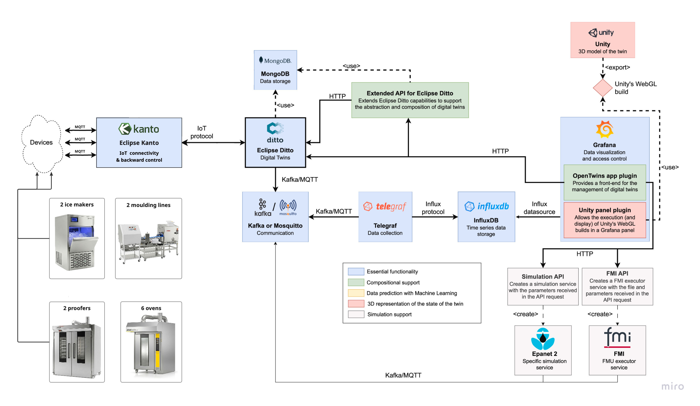

# День 3. Установка OpenEgiz

Сегодня мы переходим от сервера к самой платформе OpenEgiz.

OpenEgiz — это наша платформа для цифровых двойников. В основе есть Eclipse Ditto: Ditto хранит и обновляет состояние двойников, OpenEgiz дает удобный интерфейс для работы с ними, Grafana показывает данные, а InfluxDB хранит временные ряды.

Основная репа проекта:

https://github.com/openegiz/openegiz

Вот здесь важно еще раз посмотреть на архитектуру. На прошлых занятиях у нас были отдельные части: сервер, Docker, будущие устройства, Grafana. Теперь мы ставим систему, где все эти части начинают работать вместе.



На схеме видно главный поток: устройства или генераторы данных отправляют значения через MQTT, дальше эти данные попадают в Ditto, сохраняются в InfluxDB и показываются в Grafana. OpenEgiz работает как интерфейс управления цифровыми двойниками.

## Подготовка папки на VPS или VM

Теперь заходим на наш VPS или локальную виртуальную машину и создаем отдельную папку для тестовой установки.

```bash
mkdir test
cd test
```

Клонируем репозиторий OpenEgiz:

```bash
git clone https://github.com/openegiz/openegiz
cd openegiz
```

Если вам удобнее работать через IDE, можно открыть эту папку там. Но все команды мы будем запускать внутри сервера или виртуальной машины.

## Установка Docker

OpenEgiz поднимается в Kubernetes, но для сборки и работы нам нужен Docker.

Здесь важно не смешивать инструкции для разных систем:

```text
Debian VM  -> Docker repository для Debian
Ubuntu VPS -> Docker repository для Ubuntu
```

Если на Ubuntu добавить Debian repository, установка может ломаться или тянуть неправильные пакеты.

Сначала для любой системы убираем старые конфликтующие пакеты, если они были установлены:

```bash
sudo apt remove $(dpkg --get-selections docker.io docker-compose docker-compose-v2 docker-doc podman-docker containerd runc | cut -f1)
```

Если `apt` скажет, что таких пакетов нет, это нормально.

### Вариант A. Debian в локальной VM через VMware

Если у вас локальная виртуальная машина на Debian, используем Docker repository именно для Debian:

```bash
sudo apt update
sudo apt install ca-certificates curl
sudo install -m 0755 -d /etc/apt/keyrings
sudo curl -fsSL https://download.docker.com/linux/debian/gpg -o /etc/apt/keyrings/docker.asc
sudo chmod a+r /etc/apt/keyrings/docker.asc

sudo tee /etc/apt/sources.list.d/docker.sources <<EOF
Types: deb
URIs: https://download.docker.com/linux/debian
Suites: $(. /etc/os-release && echo "$VERSION_CODENAME")
Components: stable
Architectures: $(dpkg --print-architecture)
Signed-By: /etc/apt/keyrings/docker.asc
EOF

sudo apt update
```

### Вариант B. Ubuntu VPS или Ubuntu VM

Если у вас Ubuntu, используем Docker repository именно для Ubuntu:

```bash
sudo apt update
sudo apt install ca-certificates curl
sudo install -m 0755 -d /etc/apt/keyrings
sudo curl -fsSL https://download.docker.com/linux/ubuntu/gpg -o /etc/apt/keyrings/docker.asc
sudo chmod a+r /etc/apt/keyrings/docker.asc

sudo tee /etc/apt/sources.list.d/docker.sources <<EOF
Types: deb
URIs: https://download.docker.com/linux/ubuntu
Suites: $(. /etc/os-release && echo "${UBUNTU_CODENAME:-$VERSION_CODENAME}")
Components: stable
Architectures: $(dpkg --print-architecture)
Signed-By: /etc/apt/keyrings/docker.asc
EOF

sudo apt update
```

### Ставим Docker

После того как добавили правильный repository для своей системы, ставим Docker:

```bash
sudo apt install docker-ce docker-ce-cli containerd.io docker-buildx-plugin docker-compose-plugin
```

Проверяем, что Docker запустился:

```bash
sudo systemctl status docker
```

Если Docker не запустился сам:

```bash
sudo systemctl start docker
```

Можно проверить установку через тестовый контейнер:

```bash
sudo docker run hello-world
```

Чтобы Docker можно было запускать без `sudo`, добавляем нашего пользователя в группу `docker`:

```bash
sudo usermod -aG docker $USER
```

После этого нужно перелогиниться в SSH или выполнить:

```bash
newgrp docker
```

Проверяем:

```bash
docker ps
```

## Установка k3s

Теперь ставим k3s. Это легкий Kubernetes, который нормально подходит для нашей учебной установки на одном сервере.

```bash
curl -sfL https://get.k3s.io | sh -
```

Проверяем, что node поднялась:

```bash
sudo k3s kubectl get node
```

Чтобы `kubectl` было удобно использовать без `sudo`, настраиваем kubeconfig:

```bash
sudo chmod 644 /etc/rancher/k3s/k3s.yaml

mkdir -p ~/.kube
sudo cp /etc/rancher/k3s/k3s.yaml ~/.kube/config
sudo chown $(id -u):$(id -g) ~/.kube/config
```

Теперь проверяем уже обычной командой:

```bash
kubectl get nodes
```

## Установка Helm и make

Helm нужен для установки компонентов в Kubernetes.

```bash
curl -fsSL -o get_helm.sh https://raw.githubusercontent.com/helm/helm/main/scripts/get-helm-4
chmod 700 get_helm.sh
./get_helm.sh
```

Также нам нужен `make`, потому что в репозитории OpenEgiz установка запускается через Makefile.

```bash
sudo apt install make
```

## Установка OpenEgiz

Теперь запускаем установку OpenEgiz. Команду выполняем из директории проекта `openegiz`.

```bash
make install
```

Установка может занять некоторое время. В этот момент лучше открыть второй терминал и смотреть, как поднимаются поды:

```bash
watch -n 1 kubectl get pods
```

Нам нужно дождаться, чтобы основные поды перешли в статус `Running`.


## ВОТ ЭТО ОБЯЗАТЕЛЬНО СДЕЛАТЬ СНОВА

При первой установке MongoDB иногда не успевает запуститься до `ditto-extended-api`. Из-за этого Grafana или OpenEgiz могут не подключиться нормально. В этом случае перезапускаем deployment:

```bash
kubectl rollout restart deployment/openegiz-ditto-extended-api
```

Если установка совсем сломалась, делаем полный сброс и запускаем заново:

```bash
make uninstall
kubectl get pods
make install
```

После `make uninstall` важно проверить, что старые поды действительно исчезли.

## Первый вход в OpenEgiz

Когда все поднялось, открываем Grafana/OpenEgiz по публичному IP нашего сервера и порту `30718`.

Пример:

```text
http://34.118.106.123:30718/a/ertis-opentwins-app/policies
```


Логин и пароль по умолчанию:

```text
admin / admin
```

После первого входа пароль нужно поменять. Для учебного стенда это может выглядеть как мелочь, но на реальном сервере оставлять `admin/admin` нельзя.

В конце занятия у нас должна быть рабочая установка OpenEgiz: Kubernetes поднят, OpenEgiz установлен, Grafana открывается, интерфейс цифровых двойников доступен.
