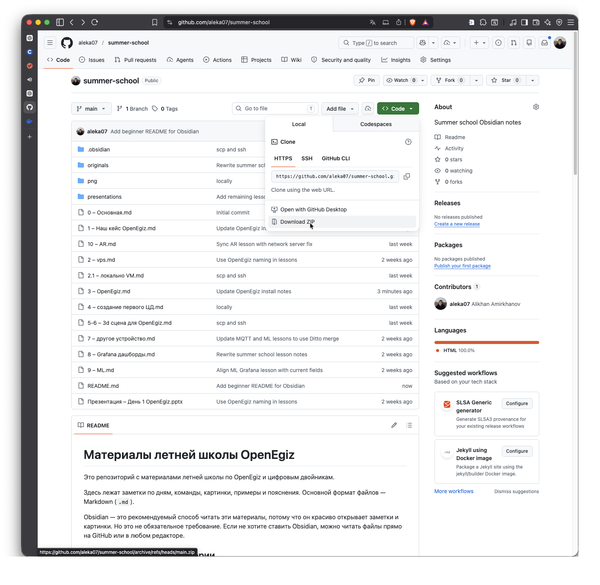

# Материалы летней школы OpenEgiz

Это репозиторий с материалами летней школы по OpenEgiz и цифровым двойникам.

Здесь лежат заметки по дням, команды, картинки, примеры и пояснения. Основной формат файлов — Markdown (`.md`).

Obsidian — это рекомендуемый способ читать эти материалы, потому что он красиво открывает заметки и картинки. Но это не обязательное требование. Если не хотите ставить Obsidian, можно читать файлы прямо на GitHub или в любом редакторе.

## Что находится в репозитории

Основные файлы:

```text
0 – Основная.md
1 – Наш кейс OpenEgiz.md
2 – vps.md
2.1 – локально VM.md
3 – OpenEgiz.md
4 – создание первого ЦД.md
5-6 – 3d сцена для OpenEgiz.md
7 – другое устройство.md
8 – Grafana дашборды.md
9 – ML.md
10 – AR.md
```

Папки:

```text
png/             картинки для заметок
presentations/   презентационные материалы
originals/        исходные версии некоторых заметок
```

## Вариант 1. Читать через Obsidian

Это рекомендуемый вариант.

### Шаг 1. Установить Obsidian

Откройте сайт:

```text
https://obsidian.md/download
```

Скачайте версию для вашей системы:

```text
Windows
macOS
Linux
```

Установите Obsidian как обычную программу.

### Шаг 2. Скачать материалы

Если у вас уже установлен `git`, выполните:

```bash
git clone https://github.com/aleka07/summer-school.git
```

Если `git` не установлен, можно скачать архив:

```text
GitHub -> Code -> Download ZIP
```



После скачивания распакуйте архив в удобную папку.

### Шаг 3. Открыть папку в Obsidian

Откройте Obsidian.

На стартовом экране выберите:

```text
Open folder as vault
```

Дальше выберите папку:

```text
summer-school
```

После этого Obsidian откроет материалы как отдельный vault.

### Шаг 4. Начать читать

Начинайте с файла:

```text
0 – Основная.md
```

Потом идите по дням:

```text
1 -> 2 -> 2.1 -> 3 -> 4 -> 5-6 -> 7 -> 8 -> 9 -> 10
```

Картинки должны открываться прямо внутри заметок. Если картинка не показывается, проверьте, что папка `png` находится рядом с `.md` файлами.

## Вариант 2. Читать без Obsidian

Obsidian не обязателен.

Можно читать материалы:

```text
на GitHub
в VS Code
в обычном текстовом редакторе
в любом Markdown viewer
```

Минус этого варианта: некоторые картинки могут отображаться не так удобно, потому что в заметках используется формат ссылок Obsidian:

```text
![[image.png]]
```

Поэтому для комфортного чтения лучше использовать Obsidian.

## Как обновлять материалы

Если вы скачали репозиторий через `git clone`, обновлять материалы можно так:

```bash
cd summer-school
git pull
```

Если вы скачивали ZIP-архив, то для обновления нужно снова скачать свежий архив с GitHub.

## Важно

Не меняйте структуру папок, если просто читаете материалы.

Особенно важно не удалять:

```text
png/
presentations/
```

Иначе в заметках могут пропасть картинки или дополнительные материалы.

## Что подготовить для практики

Для практических занятий понадобится:

```text
VPS сервер
или
локальная виртуальная машина
```

На сервере или виртуальной машине должны работать:

```bash
apt
git
```

Проверка:

```bash
apt --version
git --version
```

Дальше все команды будут описаны в заметках по дням.
