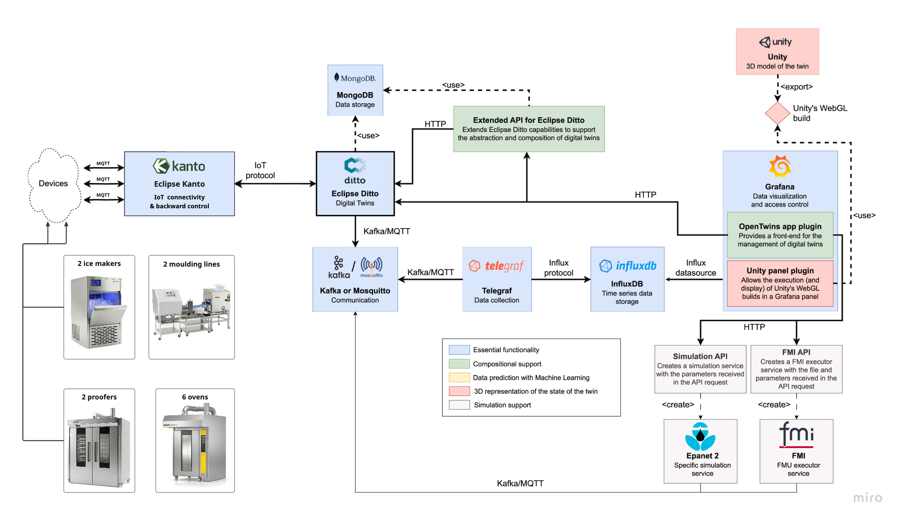

<!-- _class: lead -->

# День 1

## OpenEgiz на реальном примере

Сегодня не ставим сервер и не пишем код.

Сначала смотрим готовую систему, чтобы понимать, к чему мы идем.

---

# Зачем начинаем с готового примера

Сегодня я хочу показать финальную картинку.

Чтобы дальше, когда мы будем поднимать сервер, создавать twin, отправлять данные и строить dashboard, было понятно:

- зачем мы это делаем;
- где это потом отображается;
- как выглядит результат;
- какую роль играет OpenEgiz.

---

# Что сегодня успеем

1. Зайдем в демо OpenEgiz.
2. Посмотрим готовую 3D сцену.
3. Откроем несколько dashboards.
4. Найдем цифровые двойники в OpenTwins.
5. Разберем `Attributes` и `Features`.
6. Соберем общую картину архитектуры.

---

# Что сегодня не делаем

Сегодня мы не:

- поднимаем VPS;
- устанавливаем OpenEgiz;
- пишем генераторы данных;
- создаем своего twin;
- строим свой dashboard;
- делаем Unity-сцену.

Это будет дальше. Сегодня быстро понимаем, как выглядит рабочая система.

---

# Открываем демо-стенд

Переходим:

```text
https://dt.digitalegiz.kz
```

Логин:

```text
admin
```

Пароль я скину отдельно.

Важно: это общий демо-стенд, доступы публично не распространяем.

---

# Первый экран OpenEgiz


Здесь мы видим Grafana и OpenTwins app внутри нее.

Это рабочая точка входа для инженера.

---

# Если интерфейс на английском

Меняем язык:

```text
Profile -> Preferences -> Language
```

Выбираем русский язык и сохраняем.


---

# Смотрим 3D сцену


Здесь важно не просто посмотреть красивую картинку.

Важно понять: 3D-сцена показывает объект и его текущие данные.

---

# Что такое 3D-сцена в OpenEgiz

Логика такая:

```text
реальное оборудование
  ↓
данные
  ↓
цифровой двойник
  ↓
3D визуализация в Grafana
```

Сама сцена обычно делается отдельно, например в Unity, а потом подключается к OpenEgiz.

---

# Переходим в Dashboards


Dashboard — это рабочий экран инженера.

Здесь можно собрать графики, индикаторы, таблицы, 3D сцену и аналитику.

---

# Пример: электрические параметры


На таком dashboard инженер видит:

- ток;
- напряжение;
- коэффициент мощности;
- дисбаланс фаз.

---

# Зачем нужны такие графики

Они помогают быстро увидеть проблемы:

- просадку напряжения;
- перекос фаз;
- плохой коэффициент мощности;
- скачки и провалы в данных.

Инженер не читает сырой JSON. Он видит понятную картину.

---

# Пример: качество электроэнергии


Здесь хорошо видно цветовую индикацию:

- зеленый — нормально;
- желтый — нужно обратить внимание;
- красный — есть проблема.

---

# Пример: температура и влажность


Цифровой двойник — это не только большое промышленное оборудование.

Это может быть любой объект, у которого есть описание и данные.

---

# Переходим в OpenTwins

Открываем:

```text
OpenTwins -> Twins
```


Здесь хранятся сами цифровые двойники.

---

# Что такое twin

Каждая карточка — это отдельный цифровой двойник.

Например:

- печь;
- миксер;
- формовщик;
- шкаф;
- датчик;
- солнечная станция.

Dashboard показывает красиво. OpenTwins хранит структуру объекта.

---

# Открываем один цифровой двойник

Для примера открываем:

```text
Печь MIWE roll-in 1
```


---

# Две главные части twin

```text
Attributes — статические данные
Features   — динамические данные
```

Это ключевая мысль первого дня.

Если это понять, дальше OpenEgiz становится намного проще.

---

# Attributes

Attributes отвечают на вопрос:

```text
что это за объект?
```

Примеры:

- название;
- описание;
- тип оборудования;
- локация;
- производственный участок;
- device id.

---

# Features

Features отвечают на вопрос:

```text
что с объектом происходит сейчас?
```

Примеры:

- напряжение;
- ток;
- температура;
- влажность;
- статус;
- timestamp.

---

# Общая архитектура



OpenEgiz — это не одна программа.

Это связка компонентов для цифровых двойников, данных, dashboards и 3D-визуализации.

---

# Главная цепочка

```text
реальный объект
  ↓
данные с датчиков
  ↓
цифровой двойник в OpenTwins
  ↓
хранилище временных рядов
  ↓
dashboard в Grafana
  ↓
3D сцена и аналитика
```

---

# Что будем делать дальше

В следующие дни мы соберем похожую цепочку сами:

1. Поднимем VPS.
2. Установим OpenEgiz.
3. Создадим первый цифровой двойник.
4. Отправим в него данные.
5. Построим dashboard.
6. Сделаем 3D сцену.
7. Подключим внешний MQTT источник.
8. Добавим ML сервис.

---

<!-- _class: lead -->

# Итог дня

Сегодня мы не просто “посмотрели интерфейс”.

Мы поняли, из каких частей состоит система цифровых двойников и зачем дальше будем делать каждый шаг руками.

